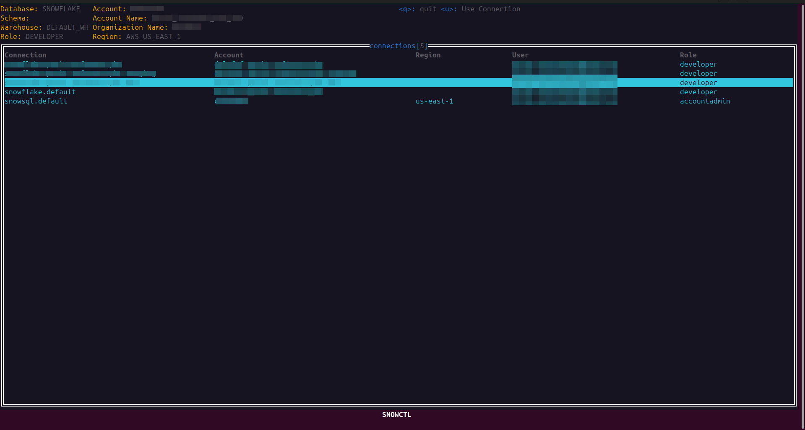
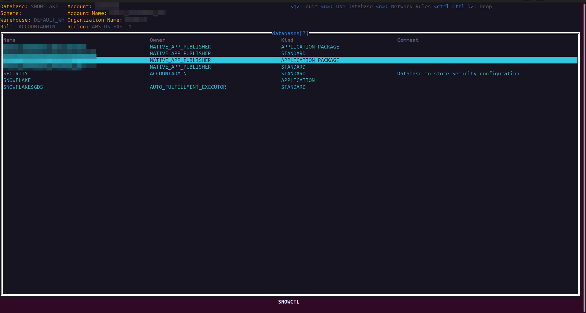
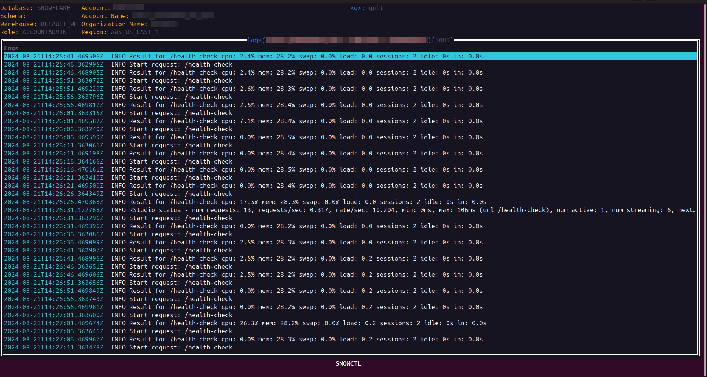

# snowctl

Snowctl is a focused administration text user interface (TUI) for exploring snowflake. It is aimed at making administrator's lives easier. It allows you to quickly navigate through snowflake objects and perform actions.

## Motivation

I've found that many tools for Snowflake are aimed at Data Scientists and directly interacting with SQL. While administering and developing Native Applications within a Snowflake account I was wanting a tool similar to [k9s](https://k9scli.io/) that allowed me to explore the account and quickly perform actions. Snowflake Compute Pools are essentially an abstraction around Kubernetes so I thought that the k9s model would work quite well here.

## Connections

`snowctl` uses the snowsql and snowflake odbc driver configuration files. See the formats for these connections:
 - [snowsql configuration file format](https://docs.snowflake.com/en/user-guide/snowsql-config) and also uses environment variables
 - [snowflake standard confguration format](https://docs.snowflake.com/en/developer-guide/python-connector/python-connector-connect#connecting-using-the-connections-toml-file) and also uses environment variables

## Installation

[GoReleaser](https://goreleaser.com/) is used for `snowctl` releases.

1. Visit the [GitHub releases page](https://github.com/costrouc/snowctl/releases)
2. Download the tarball or zip for your platform
3. Extract the archive and move the binary to directory within your path

### Development

We use the  [Snowflake go odbc driver](https://pkg.go.dev/github.com/snowflakedb/gosnowflake) which supports most forms of authentication. Additionally we internally use the [Snowflake terraform provider snowflae sdk](https://github.com/Snowflake-Labs/terraform-provider-snowflake/tree/main/pkg/sdk). Currently we have had to shim much of the sdk since it does not support many interesting PuPr and PrPr features.


```shell
go run cmd/snowctl/main.go
```

## License

[Apache License v2.0](./LICENSE)

## Screenshots

### Change accounts

Users can easily switch between accounts when using `snowctl`



### View Objects



### View Service Logs



## Objects Supported

Not all snowflake objects are supported. A best effort has been made to keep these checklists up to date.

Symbols:
 - `X` fully supported
 - `O` partially supported
 - `-` not relevant

| Object                          | SHOW | DROP | ALTER |
| ------------------------------- | ---- | ---- | ----- |
| **Account Operations**          | -    | -    | -     |
| ACCOUNTS                        |      |      |       |
| CONNECTIONS                     |      |      |       |
| GLOBAL ACCOUNTS                 |      |      |       |
| ORGANIZATION ACCOUNTS           |      |      |       |
| PARAMETERS                      |      |      |       |
| REGIONS                         |      |      |       |
| RELEASE DIRECTIVES              | X    |      |       |
| REPLICATION ACCOUNTS            |      |      |       |
| VERSIONS                        | X    |      |       |
| **Session**                     | -    | -    | -     |
| LOCKS                           |      |      |       |
| PARAMETERS                      |      |      |       |
| TRANSACTIONS                    |      |      |       |
| VARIABLES                       |      |      |       |
| **Account**                     |      |      |       |
| APPLICATIONS                    | X    |      |       |
| APPLICATION PACKAGES            | X    |      |       |
| AUTHENTICATION POLICIES         |      |      |       |
| CATALOG INTEGRATIONS            |      |      |       |
| COMPUTE POOLS                   | X    | X    | X     |
| DATABASE ROLES                  |      |      |       |
| DATABASES                       | X    | X    |       |
| EXTERNAL VOLUMES                |      |      |       |
| FAILOVER GROUPS                 |      |      |       |
| INTEGRATIONS                    | X    |      |       |
| FUNCTIONS                       |      |      |       |
| GRANTS                          | X    |      |       |
| NETWORK POLICIES                | X    |      |       |
| PARAMETERS                      |      |      |       |
| REPLICATION DATABASES           |      |      |       |
| REPLICATION GROUPS              |      |      |       |
| RESOURCE MONITORS               |      |      |       |
| ROLES                           | X    |      |       |
| SHARES                          |      |      |       |
| USERS                           | X    |      |       |
| WAREHOUSES                      | X    | X    |       |
| **Database Objects**            | -    | -    | -     |
| AGGREGATION POLICIES            |      |      |       |
| ALERTS                          |      |      |       |
| AUTHENTICATION POLICIES         |      |      |       |
| DATA METRIC FUNCTIONS           |      |      |       |
| CHANNELS                        |      |      |       |
| CLASSES                         |      |      |       |
| COLUMNS                         |      |      |       |
| CORTEX SEARCH SERVICES          |      |      |       |
| DYNAMIC TABLES                  |      |      |       |
| EVENT TABLES                    |      |      |       |
| EXTERNAL FUNCTIONS              |      |      |       |
| EXTERNAL TABLES                 |      |      |       |
| FILE FORMATS                    |      |      |       |
| FUNCTIONS                       |      |      |       |
| GIT BRANCHES                    |      |      |       |
| GIT REPOSITORIES                |      |      |       |
| GIT TAGS                        |      |      |       |
| HYBRID TABLES                   |      |      |       |
| ICEBERG TABLES                  |      |      |       |
| INDEXES                         |      |      |       |
| IMAGE REPOSITORIES              | X    |      |       |
| LISTINGS                        | X    |      |       |
| MATERIALIZED VIEWS              |      |      |       |
| MASKING POLICIES                |      |      |       |
| MODELS                          |      |      |       |
| NETWORK RULES                   | X    |      |       |
| NOTEBOOKS                       |      |      |       |
| OBJECTS                         |      |      |       |
| PACKAGES POLICIES               |      |      |       |
| PASSWORD POLICIES               |      |      |       |
| PIPES                           |      |      |       |
| PROCEDURES                      | X    |      |       |
| PROJECTION POLICIES             |      |      |       |
| ROW ACCESS POLICIES             |      |      |       |
| SCHEMAS                         | X    | X    |       |
| SECRETS                         | X    | X    |       |
| SERVICES                        | X    | X    |       |
| SESSION POLICIES                |      |      |       |
| SEQUENCES                       |      |      |       |
| SNAPSHOTS                       | X    | X    |       |
| STAGES                          | X    | X    |       |
| STREAMS                         |      |      |       |
| STREAMLITS                      | X    |      |       |
| TABLES                          | X    | X    |       |
| TAGS                            |      |      |       |
| TASKS                           |      |      |       |
| USER FUNCTIONS                  |      |      |       |
| VERSIONS IN MODEL               |      |      |       |
| VIEWS                           | X    |      |       |
| **Classes**                     | -    | -    | -     |
| SNOWFLAKE.ML.ANOMALY_DETECTION  |      |      |       |
| BUDGET                          |      |      |       |
| SNOWFLAKE.ML.CLASSIFICATION     |      |      |       |
| CUSTOM_CLASSIFIER               |      |      |       |
| SNOWFLAKE.ML.FORECAST           |      |      |       |

